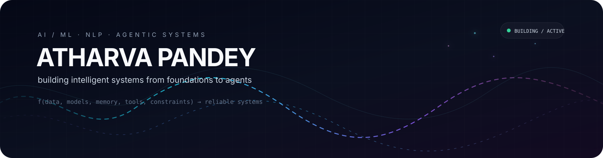
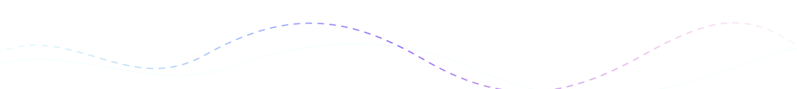

<div align="center">



<br/>

<a href="https://readme-typing-svg.demolab.com">
  
</a>

<br/>

<a href="https://github.com/newtonspaxe-source">
  
</a>
&nbsp;
<a href="https://www.linkedin.com/in/atharva-pandey-2ab044372">
  
</a>
&nbsp;
<a href="mailto:newtonspaxe@gmail.com">
  
</a>

</div>

---

<table align="center">
<tr>
<td align="center" width="33%">

### `01`
**LEARN**

Mathematics · ML · DL

</td>
<td align="center" width="33%">

### `02`
**BUILD**

NLP · Transformers · Agents

</td>
<td align="center" width="33%">

### `03`
**ENGINEER**

Memory · Tools · Evaluation

</td>
</tr>
</table>

<div align="center">

```text
                     xₜ  +  memoryₜ  +  toolsₜ
                              │
                              ▼
                       ┌─────────────┐
                       │   MODEL     │
                       └──────┬──────┘
                              │
                              ▼
                       ┌─────────────┐
                       │   SYSTEM    │
                       └──────┬──────┘
                              │
                    constraints / evidence
                              │
                              ▼
                           actionₜ
```

</div>

## ⚙️ Stack

<div align="center">


<br/><br/>


</div>

---

## 🧪 Selected Work

<div align="center">

| | Project | Focus |
|:--:|:--|:--|
| `01` | **Agentic AI 360** | Event-driven multi-agent systems |
| `02` | **Transformer Translator** | Attention · Seq2Seq · NLP |
| `03` | **LSTM Sentiment Analyzer** | Sequence modelling · NLP |
| `04` | **Regression Experiments** | Statistical learning |

</div>

> More implementation details live inside the individual repositories.

---

## 📡 GitHub Telemetry

<div align="center">


&nbsp;


<br/>


</div>

---

## 🐍 Contribution Flow

<p align="center">
  <picture>
    <source media="(prefers-color-scheme: dark)" srcset="https://raw.githubusercontent.com/newtonspaxe-source/newtonspaxe-source/output/github-snake-dark.svg" />
    <source media="(prefers-color-scheme: light)" srcset="https://raw.githubusercontent.com/newtonspaxe-source/newtonspaxe-source/output/github-snake.svg" />
    
  </picture>
</p>

<div align="center">

### `building quietly. shipping loudly.`



</div>
