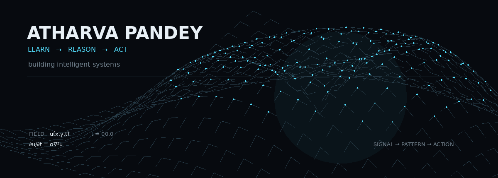
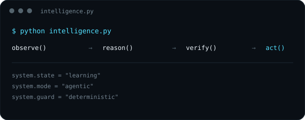
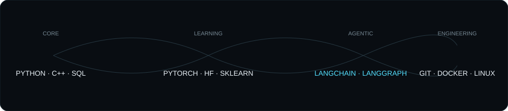
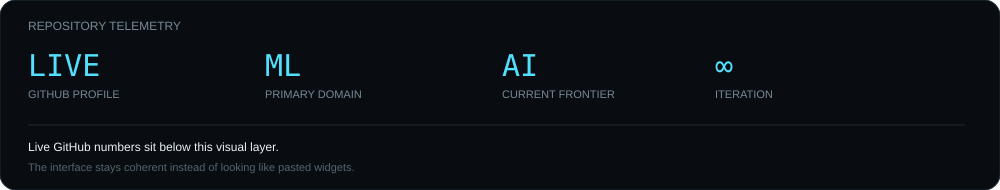
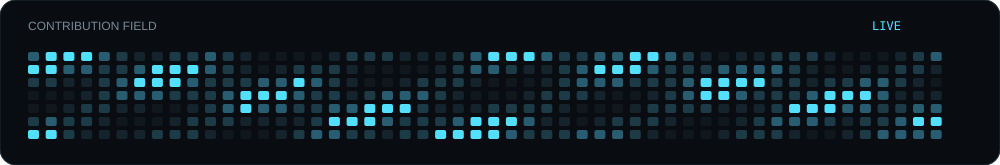
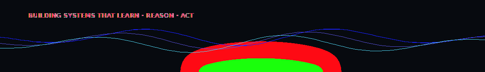

 

### `LEARN → REASON → ACT`

  building intelligent systems at the intersection of mathematics, machine learning and agentic AI.

 

---

## ◈ SYSTEM / TOOLCHAIN

  

  
    Python · C++ · SQL · NumPy · Pandas · Scikit-learn · PyTorch · Hugging Face ·
    LangChain · LangGraph · LangSmith · Git · GitHub · Docker · Linux · VS Code
  

---

## ◇ SELECTED SYSTEMS

<table>
<tr>
<td align="center" width="33%">

### `01`
**Transformer Lab**

Custom Transformer / seq2seq work built from the architecture upward.

</td>
<td align="center" width="33%">

### `02`
**Language & Representation**

Neural models, representation learning, evaluation and experimentation.

</td>
<td align="center" width="33%">

### `03`
**Agentic AI 360**

Event-driven multi-agent reasoning, debate, guardrails and human approval.

</td>
</tr>
</table>

Detailed implementation, architecture and demos live inside the repositories.

---

## ⌁ REPOSITORY TELEMETRY

  

&nbsp;

 

 

---

## ∿ CURRENT FRONTIER

`FOUNDATION MODELS` · `MULTI-AGENT SYSTEMS` · `REASONING` · `OBSERVABILITY` · `SAFE AI`

  

less dashboard · more systems

---

 

&nbsp;

